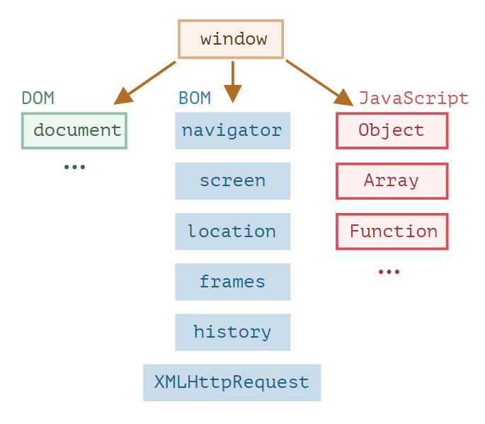

<h1 align="center"> 
 WINDOW :
</h1>

```

Язык JavaScript изначально был создан для веб-браузеров.
Но с тех пор он значительно эволюционировал и
превратился в кроссплатформенный язык программирования
для решения широкого круга задач.


Сегодня JavaScript может использоваться в браузере,
на веб-сервере или в какой-то другой среде, даже в кофеварке.
Каждая среда предоставляет свою функциональность,
которую спецификация JavaScript называет окружением.


Окружение предоставляет свои объекты и дополнительные
функции, в дополнение базовым языковым.
Браузеры, например, дают средства для управления
веб-страницами. Node.js делает доступными какие-то
серверные возможности и так далее.


На картинке ниже в общих чертах показано,
что доступнодля JavaScript в браузерном окружении:

```

<h1 align="center">



</h1>

> Как мы видим, имеется корневой объект window, который выступает в 2 ролях:

> Во-первых, это глобальный объект для JavaScript-кода, об этом более подробно говорится в главе Глобальный объект.

> Во-вторых, он также представляет собой окно браузера и располагает методами для управления им.

## Например, здесь мы используем window как глобальный объект:

```

function sayHi() {
alert("Hello");
}

// глобальные функции доступны как методы глобального объекта:
window.sayHi();

```

## А здесь мы используем window как объект окна браузера, чтобы узнать его высоту:

```
alert(window.innerHeight);ad
```

---

---

---

---

---

---

---

<h1 align= "center">
DOM

( document object modal )

</h1>

> Document Object Model, сокращённо DOM – объектная модель документа, которая представляет все содержимое страницы в виде объектов, которые можно менять.

> Объект document – основная «входная точка». С его помощью мы можем что-то создавать или менять на странице.

<h1 align="center">
 METHODS :
</h1>

- getElementById () - Возвращает элемент с указанным идентификатором.

- getElementsByClassName () - Возвращает список всех элементов с указанным имя класса.

- querySelector() - ById + ByClassName

- AppendChild () - Чтобы добавить новый дочерний узел к указанному узлу.

- RemoveChild () - Удаляет дочерний узел.

- createElement () - Создать узел элемента.

- innerHTML = ' ' ( добавляет значение! )

<h1 align="center">
События мыши:
</h1>

- onclick – происходит, когда кликнули на элемент левой кнопкой мыши (на устройствах с сенсорными экранами оно происходит при касании).

- contextmenu – происходит, когда кликнули на элемент правой кнопкой мыши.

- mouseover / mouseout – когда мышь наводится на / покидает элемент.

- mousedown / mouseup – когда нажали / отжали кнопку мыши на элементе.

- mousemove – при движении мыши.

<h1 align="center">
 classlist :
</h1>

- calsslist.add ( String, [String]) - Добавляет указанные классы к элементу
- calsslist.remove ( String, [String]) - Удаляет указанные классы из элемента
- calsslist.toggle ( String, [Boolean]) - Если у элемента нет класса, он добавляет его, иначе удаляет.

---

---

---

---

---

---

---

---

<h1 align="center"> BOM :

Browser Object Model

</h1>

> Объектная модель браузера (Browser Object Model, BOM) – это дополнительные объекты, предоставляемые браузером (окружением), чтобы работать со всем, кроме документа.

## Например:

- Объект navigator даёт информацию о самом браузере и операционной системе. Среди множества его свойств самыми известными являются: navigator.userAgent – информация о текущем браузере, и navigator.platform – информация о платформе (может помочь в понимании того, в какой ОС открыт браузер – Windows/Linux/Mac и так далее).
 
- Объект location позволяет получить текущий URL и перенаправить браузер по новому адресу.