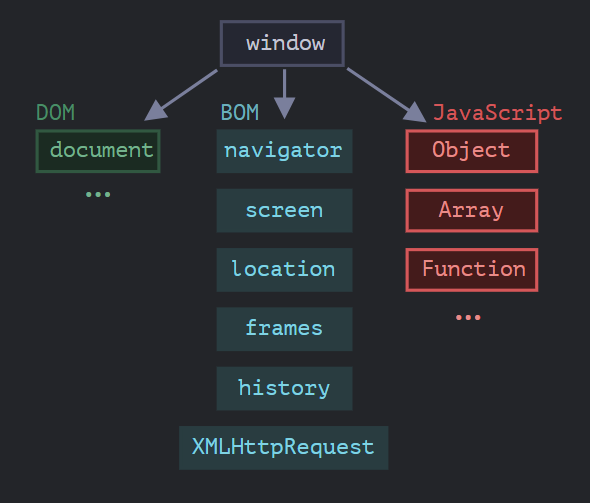

<h1 align="center"> 
 BOM :
</h1>

```
Язык JavaScript изначально был создан для веб-браузеров. Но с тех пор он значительно эволюционировал и превратился в кроссплатформенный язык программирования для решения широкого круга задач.

Сегодня JavaScript может использоваться в браузере, на веб-сервере или в какой-то другой среде, даже в кофеварке. Каждая среда предоставляет свою функциональность, которую спецификация JavaScript называет окружением.

Окружение предоставляет свои объекты и дополнительные функции, в дополнение базовым языковым. Браузеры, например, дают средства для управления веб-страницами. Node.js делает доступными какие-то серверные возможности и так далее.

На картинке ниже в общих чертах показано, что доступно для JavaScript в браузерном окружении:
```
<h1 align="center">



</h1>

```
Как мы видим, имеется корневой объект window, который выступает в 2 ролях:

Во-первых, это глобальный объект для JavaScript-кода, об этом более подробно говорится в главе Глобальный объект.
Во-вторых, он также представляет собой окно браузера и располагает методами для управления им.

```