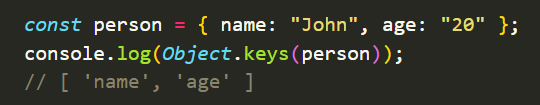
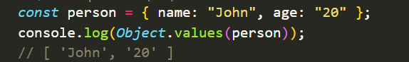
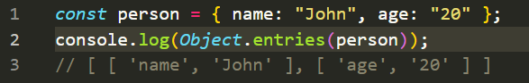

# OBJECT

- Destructuring
- Spread
- Tthis
- New Date()

```
 Объект — это набор свойств, и каждое свойство состоит из имени и значения, ассоциированного с этим именем.
 Значением свойства может быть функция, которую можно назвать методом объекта.

```

<h1 align='center'>

</h1>

<pre>

   let car = {
    model: 'Range Rover'б
    color: 'Red',
   }

</pre>

> car - name object

> color - key

> red - value

<h1 align ="center" >
 Methods object :
</h1>

# Object.keys()



# Object.values()



# Object.entries()


