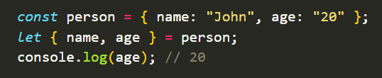
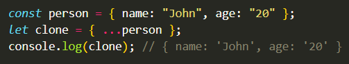
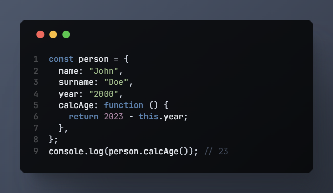
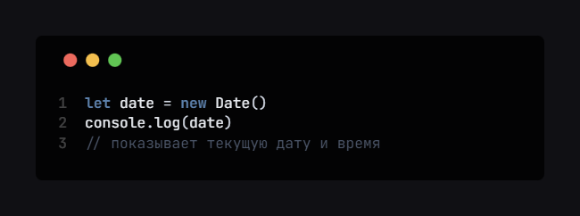
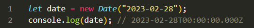
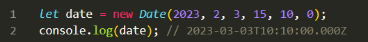

# OBJECT

- Destructuring
- Spread
- Tthis
- New Date()

```
 Объект — это набор свойств, и каждое свойство состоит из имени и значения, ассоциированного с этим именем.
 Значением свойства может быть функция, которую можно назвать методом объекта.
```

<h1 align='center'>

</h1>

<pre>

   let car = {
    model: 'Range Rover'б
    color: 'Red',
   }
</pre>

> car - name object

> color - key

> red - value

<h1 align ="center" >
 Methods object :
</h1>

# Object.keys()


# Object.values()


# Object.entries()

## 

---

<h1 align="center"> Destructing & Spread : </h1>

## Destructing:



## Spread:

## 

---

<h1 align="center">THIS :</h1>

> keyword this - ключевое слово this



---

<h1 align = "center">
DATA AND TIME :
</h1>

> Встречайте новый встроенный объект: Date. Он содержит дату и время, а также предоставляет методы управления ими.
> Например, его можно использовать для хранения времени создания/изменения, для измерения времени или просто для вывода текущей даты.

- Создание

> Для создания нового объекта Date нужно вызвать конструктор
> new Date() с одним из следующих аргументов:



```
Если внутри new Date( ) добавить параметр объект начинает считать с 1 января 1970г UTC +
```

<h1 align='center'>
new Date(date string)
</h1>

```
   new Date — (date string) создает новый объект даты из строки даты. В JavaScript обычно существует три формата ввода даты. Форматы даты ISO Вы можете создать объект даты, передав форматы даты ISO.
```



<h1 align="center"> Date and Time: </h1>

<h4 align="center"> 
 Последовательность не меняется :
</h4>

<h2 align="center">
 new Date ( year, month, day, hours, minutes, second, millisecond )
</h2>



```
Примечание. Если вы передадите только один аргумент, он будет считаться миллисекундами. Поэтому, чтобы использовать этот формат даты, вы должны передать два аргумента. В JavaScript месяцы считаются от 0 до 11. Январь равен 0, а декабрь — 11.
```

<h1 align="center">
DATA AND TIME METHODS :
</h1>

 `now ( )` - Возвращает числовое значение, соответствующее текущему времени (количество миллисекунд, прошедших с 00:00:00 UTC 1 января 1970 г.)

- `getFullYear ( )` - Получает год по местному времени

- `getMoth ( )` - Получает месяц от 0 до 11 по местному времени

- `getDate ( )` - Получает день месяца (1-31) по местному времени

- `getDay ( )` - Получает день недели (0-6) по местному времени.

- `getHours ( )` - Получает час от 0 до 23 по местному времени

- `getMinutes ( )` Получает час от 0 до 59 по местному времени

- `getTime ( )` - Получает день месяца (1-31) по всемирному времени

- `getUTCDate ( )` - Получает день месяца (1-31) по всемирному времени

<h1 align="center"> SET :</h1>

- `setFullYear ( )` - Устанавливает полный год по местному времени

- `setMonth ( )` - Устанавливает месяц по местному времени

- `setDate ( )` - Устанавливает день месяца по местному времени.

- `setUTCDate ( )` - Устанавливает день месяца по всемирному времени
