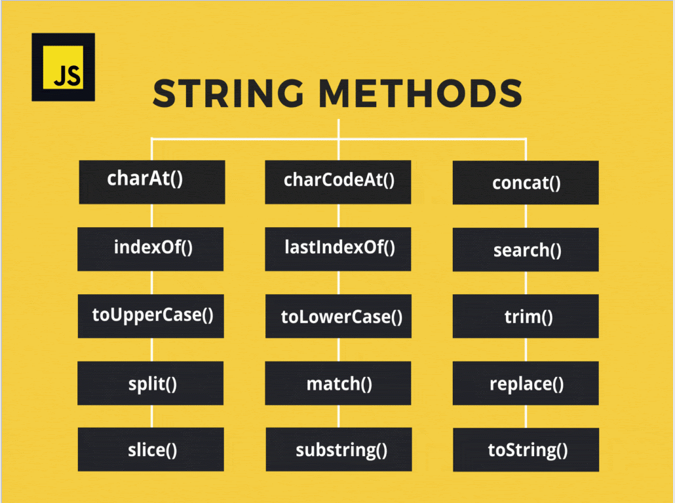

## CharAt:

Метод charAt() возвращает указанный символ из строки.

## Concat:

Метод concat() объединяет текст из двух или более строк и возвращает новую строку.

## Includes:

Метод includes() проверяет, содержит ли строка заданную подстроку, и возвращает, соответственно true или false.

## Length:

методи text.length() дарозии текста хисоб мекна

## Repeat:

методи repeat() - стринга такрор када нишон мета то ракаи мехостагита

## Search:

При успехе метод search() возвращает индекс первого сопоставления с регулярным выражением внутри строки. В противном случае метод вернёт -1.

## Slice:

Метод slice() извлекает часть строки и возвращает новую строку без изменения оригинальной строки.

## Split:

Метод split() возвращает новый массив.

## Substring:

Метод substring() возвращает подстроку строки между двумя индексами,
или от одного индекса и до конца строки.

## LowerCase:

Метод toLowerCase() возвращает значение строки, на которой он был вызван,
преобразованное в нижний регистр.

## UpperCase:

Метод toUpperCase() возвращает значение строки, на которой он был вызван,
преобразованное в верхний регистр.

## Trim:

trim() удаляет отступы с лево и право

## Eval:

Метод eval() выполняет JavaScript-код, представленный строкой.

## Replace:

Метод replace() возвращает новую строку с некоторыми или всеми сопоставлениями с шаблоном, заменёнными на заменитель.

## Match: 
Метод match() извлекает результат сопоставления строки с регулярным выражением .